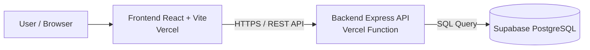
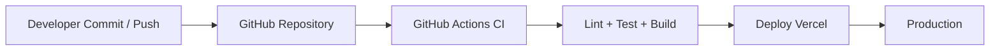
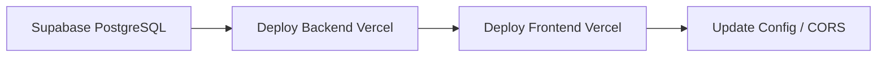

# BÁO CÁO ĐỒ ÁN

## Đề tài

**ExpenseFlow - Website Quản lý chi tiêu**

- Frontend production: `https://quan-ly-chi-tieu-vbcv.vercel.app`
- Backend production: `https://quan-ly-chi-tieu-iojt.vercel.app`
- Database production: Supabase PostgreSQL

---

# CHƯƠNG 1: TỔNG QUAN

## 1.1 Mục tiêu

### Mục tiêu chung

Xây dựng một hệ thống quản lý chi tiêu cá nhân hoàn chỉnh theo mô hình full-stack, gồm giao diện người dùng, backend API, cơ sở dữ liệu, cấu hình Docker, CI/CD và triển khai production thực tế.

### Nội dung chuyên môn

- Xây dựng hệ thống hoàn chỉnh gồm **Frontend + Backend + Database**
- Thiết kế và triển khai hệ thống chạy được trên **production**
- Ứng dụng có **CI/CD** bằng GitHub Actions
- Ứng dụng có **Dockerfile** và **docker-compose.yml**
- Hệ thống hỗ trợ quy trình debug theo layer và có xử lý incident thực tế

## 1.2 Mô tả chức năng

Các chức năng chính của hệ thống:

- **Authentication**
  - Đăng ký
  - Đăng nhập
  - Đăng xuất
  - Xác thực phiên đăng nhập bằng token

- **Quản lý danh mục**
  - Thêm danh mục
  - Xem danh sách danh mục
  - Sửa danh mục
  - Xóa danh mục

- **Quản lý giao dịch**
  - Thêm khoản thu / chi
  - Xem danh sách giao dịch theo tháng
  - Sửa giao dịch
  - Xóa giao dịch

- **Dashboard / Thống kê**
  - Tổng thu nhập
  - Tổng chi tiêu
  - Số dư hiện tại
  - Thống kê theo tháng
  - Thống kê theo danh mục
  - Biểu đồ xu hướng giao dịch

## 1.3 Phạm vi

### Bao gồm

- Website quản lý chi tiêu cá nhân
- Giao diện frontend hiện đại, responsive
- Backend REST API
- Kết nối cơ sở dữ liệu PostgreSQL trên Supabase
- Docker local để chạy đầy đủ frontend, backend, database
- CI bằng GitHub Actions
- Deploy production lên Vercel
- Theo dõi và xử lý incident thực tế

### Không bao gồm

- Thanh toán trực tuyến
- Đồng bộ ngân hàng tự động
- Phân quyền nhiều vai trò quản trị
- Ứng dụng mobile native
- Hệ thống thông báo push/email

---

# CHƯƠNG 2: THIẾT KẾ HỆ THỐNG

## 2.1 Kiến trúc tổng thể

Hệ thống được xây dựng theo mô hình 3 lớp:

- **Frontend**: React + Vite
- **Backend API**: Express.js
- **Database**: PostgreSQL

### Sơ đồ kiến trúc tổng thể



### Flow xử lý

1. Người dùng thao tác trên giao diện frontend
2. Frontend gửi request đến backend API
3. Backend xác thực, xử lý business logic
4. Backend truy vấn hoặc cập nhật dữ liệu ở database
5. Backend trả JSON response cho frontend
6. Frontend cập nhật giao diện cho người dùng

## 2.2 Kiến trúc DevOps

Hệ thống áp dụng quy trình DevOps cơ bản gồm quản lý source code, CI, Docker hóa và deploy production.

### Sơ đồ CI/CD Flow



### Giải thích quy trình

- **Code**: lập trình viên phát triển trên nhánh `feature/*`, gộp vào `dev`, sau đó đưa lên `main`
- **CI**: GitHub Actions tự động chạy khi `push` hoặc `pull_request`
- **Build**: pipeline kiểm tra cài dependency, lint, test, build
- **Deploy**: sau khi source code ổn định, frontend và backend được deploy lên Vercel

## 2.3 API

### Endpoint bắt buộc

- `GET /api/health`

### Danh sách API chính

#### Authentication

- `POST /api/auth/register`
- `POST /api/auth/login`
- `GET /api/auth/me`
- `POST /api/auth/logout`

#### Category

- `GET /api/categories`
- `POST /api/categories`
- `PUT /api/categories/:id`
- `DELETE /api/categories/:id`

#### Transaction

- `GET /api/transactions?month=YYYY-MM`
- `POST /api/transactions`
- `PUT /api/transactions/:id`
- `DELETE /api/transactions/:id`

#### Dashboard

- `GET /api/dashboard/summary?month=YYYY-MM`

---

# CHƯƠNG 3: TRIỂN KHAI HỆ THỐNG

## 3.1 Backend

### Công nghệ sử dụng

- Node.js
- Express.js
- PostgreSQL client `pg`
- Custom token authentication
- Deploy bằng Vercel Function

### Mô tả API

Backend cung cấp các API REST để xử lý:

- xác thực người dùng
- CRUD danh mục
- CRUD giao dịch
- tổng hợp thống kê dashboard

Các route chính được tổ chức tại:

- [backend/src/routes/authRoutes.js](<d:/Nam4_HK2/Chuyen de cn moi/Code/QuanLyChiTieu/backend/src/routes/authRoutes.js>)
- [backend/src/routes/categoryRoutes.js](<d:/Nam4_HK2/Chuyen de cn moi/Code/QuanLyChiTieu/backend/src/routes/categoryRoutes.js>)
- [backend/src/routes/transactionRoutes.js](<d:/Nam4_HK2/Chuyen de cn moi/Code/QuanLyChiTieu/backend/src/routes/transactionRoutes.js>)
- [backend/src/routes/dashboardRoutes.js](<d:/Nam4_HK2/Chuyen de cn moi/Code/QuanLyChiTieu/backend/src/routes/dashboardRoutes.js>)

### Kết nối database

Backend kết nối tới PostgreSQL thông qua:

- [backend/src/db/pool.js](<d:/Nam4_HK2/Chuyen de cn moi/Code/QuanLyChiTieu/backend/src/db/pool.js>)
- [backend/src/db/init.js](<d:/Nam4_HK2/Chuyen de cn moi/Code/QuanLyChiTieu/backend/src/db/init.js>)

Khi khởi động:

- backend đọc `DATABASE_URL`
- khởi tạo pool kết nối PostgreSQL
- tự tạo bảng nếu chưa tồn tại

## 3.2 Frontend

### Công nghệ sử dụng

- React 19
- TypeScript
- Vite
- Tailwind CSS
- Lucide Icons

### Gọi API backend

Frontend gọi API thông qua:

- [frontend/src/lib/api.ts](<d:/Nam4_HK2/Chuyen de cn moi/Code/QuanLyChiTieu/frontend/src/lib/api.ts>)

Các request được gửi đến backend bằng `fetch`, sử dụng:

- `VITE_API_BASE_URL`
- token `Authorization: Bearer ...`

### Không lỗi console

Frontend production đã được kiểm tra theo checklist:

- load được trang
- thực hiện đăng ký / đăng nhập
- gọi API thật từ production backend
- không phát sinh lỗi console sau khi cấu hình env đúng

## 3.3 Environment (RẤT QUAN TRỌNG)

### Bắt buộc phải có

- `.env` dùng local, **không commit**
- `.env.example` dùng làm mẫu, **được commit**

File mẫu:

- [.env.example](<d:/Nam4_HK2/Chuyen de cn moi/Code/QuanLyChiTieu/.env.example>)

### Không được phép

- hardcode API URL
- hardcode DB connection
- hardcode API key
- hardcode secret trực tiếp trong source

### Quy tắc cấu hình

- Frontend production dùng `VITE_API_BASE_URL`
- Backend dùng `DATABASE_URL`, `JWT_SECRET`, `FRONTEND_URL`
- Vercel và Supabase giữ secret ở dashboard, không đưa vào source code

## 3.4 Docker (BẮT BUỘC – 20 ĐIỂM)

### Thành phần bắt buộc

- [backend/Dockerfile](<d:/Nam4_HK2/Chuyen de cn moi/Code/QuanLyChiTieu/backend/Dockerfile>)
- [frontend/Dockerfile](<d:/Nam4_HK2/Chuyen de cn moi/Code/QuanLyChiTieu/frontend/Dockerfile>)
- [docker-compose.yml](<d:/Nam4_HK2/Chuyen de cn moi/Code/QuanLyChiTieu/docker-compose.yml>)

### Lệnh chạy

```bash
docker compose up -d --build
```

### Vai trò từng service

- `db`: PostgreSQL container, lưu dữ liệu local khi chạy bằng Docker
- `backend`: Express API container, kết nối tới database container
- `frontend`: Nginx + static build frontend

### Minh chứng cần chèn khi nộp

- Screenshot `docker compose ps`
- Screenshot Docker Desktop với 3 container running
- Screenshot `docker compose logs backend`
- Screenshot `docker compose logs frontend`
- Screenshot `docker compose logs db`

## 3.5 Git & Branching

### Chiến lược branch

- `main`
- `dev`
- `feature/*`

### Quy trình sử dụng

- phát triển chức năng trên `feature/*`
- gộp vào `dev`
- kiểm tra ổn định rồi đưa lên `main`

### Yêu cầu lịch sử commit

- không commit một lần cuối duy nhất
- có lịch sử commit theo từng giai đoạn

### Minh chứng cần chèn

- Screenshot danh sách branch trên GitHub
- Screenshot lịch sử commit

## 3.6 CI — Continuous Integration (15 ĐIỂM)

### Công cụ sử dụng

- GitHub Actions

### File cấu hình

- [.github/workflows/ci.yml](<d:/Nam4_HK2/Chuyen de cn moi/Code/QuanLyChiTieu/.github/workflows/ci.yml>)

### Nội dung pipeline

#### Backend

- install dependency
- lint
- test
- build

#### Frontend

- install dependency
- lint
- typecheck
- test
- build

### Yêu cầu đạt được

- pipeline fail nếu có lỗi
- không bypass
- pipeline chạy tự động theo `push` và `pull_request`

### Minh chứng cần chèn

- Screenshot GitHub Actions xanh
- Screenshot chi tiết job backend
- Screenshot chi tiết job frontend

---

# CHƯƠNG 4: DEPLOY (15 ĐIỂM)

## 4.1 Môi trường

Hệ thống được deploy trên:

- **Frontend**: Vercel
- **Backend**: Vercel
- **Database**: Supabase PostgreSQL

## 4.2 Quy trình deploy

Trình tự deploy được thực hiện như sau:

1. Tạo và cấu hình Supabase database
2. Deploy backend lên Vercel
3. Lấy backend URL
4. Deploy frontend lên Vercel
5. Cập nhật lại CORS / ENV giữa frontend và backend
6. Redeploy backend nếu cần

### Sơ đồ triển khai



## 4.3 Minh chứng

### URL public

- Frontend: `https://quan-ly-chi-tieu-vbcv.vercel.app`
- Backend: `https://quan-ly-chi-tieu-iojt.vercel.app`
- Health check: `https://quan-ly-chi-tieu-iojt.vercel.app/api/health`

### Screenshot cần chèn

- Ảnh hệ thống chạy online
- Ảnh frontend production
- Ảnh backend health response
- Ảnh đăng nhập / dashboard production

---

# CHƯƠNG 5: LOGGING & DEBUG (10 ĐIỂM)

## 5.1 Logging

### Backend log

- xem runtime log trên Vercel backend
- kiểm tra lỗi xác thực, lỗi DB, lỗi route

### Docker log

- `docker compose logs backend`
- `docker compose logs frontend`
- `docker compose logs db`

### Deploy log

- log build/deploy trên Vercel
- log pipeline trên GitHub Actions

## 5.2 Debug theo layer

### L4: Frontend

- kiểm tra console browser
- kiểm tra `Network`
- kiểm tra `VITE_API_BASE_URL`

### L3: Backend

- kiểm tra runtime log trên Vercel
- kiểm tra route API
- kiểm tra CORS

### L2: Database

- kiểm tra `DATABASE_URL`
- kiểm tra kết nối Supabase
- kiểm tra query và schema

### L1: Infrastructure

- kiểm tra Vercel deployment
- kiểm tra branch deploy
- kiểm tra environment variables
- kiểm tra Docker container

## 5.3 INCIDENT (BẮT BUỘC ≥ 3 lỗi)

### Incident 1

- **Hiện tượng:** Sau khi deploy production, người dùng bấm đăng ký thì request bị chặn, frontend không thể gọi backend.
- **Log:** Browser Console hiển thị:
  ```text
  Access to fetch at 'https://expense-flow-backend.vercel.app/api/auth/register'
  from origin 'https://quan-ly-chi-tieu-vbcv.vercel.app'
  has been blocked by CORS policy:
  The 'Access-Control-Allow-Origin' header has a value
  'https://expense-flow-three.vercel.app'
  that is not equal to the supplied origin.
  ```
- **Layer:** `L3 Backend / Config`
- **Nguyên nhân:** Backend Vercel đang dùng `FRONTEND_URL` cũ, không khớp domain frontend production thực tế.
- **Cách fix:**
  - vào Vercel backend project
  - sửa `FRONTEND_URL=https://quan-ly-chi-tieu-vbcv.vercel.app`
  - redeploy backend
- **Cách phòng tránh:**
  - tách origin ra ENV
  - thêm `FRONTEND_URLS` để hỗ trợ nhiều domain frontend
  - kiểm tra lại CORS sau mỗi lần đổi domain production
- **Hình minh họa:** ảnh Console báo CORS + ảnh env backend trên Vercel

### Incident 2

- **Hiện tượng:** Domain backend mở được nhưng `/api/health` trả `500`, Vercel hiển thị function crash.
- **Log:** Vercel Runtime Logs hiển thị:
  ```text
  Error: getaddrinfo ENOTFOUND db.plfkdasoelnzkhzrztus.supabase.co
      at async initDatabase (file:///var/task/backend/src/db/init.js:38:3)
      at async ensureReady (file:///var/task/backend/api/index.js:13:3)
  ```
- **Layer:** `L2 Database / Config`
- **Nguyên nhân:** `DATABASE_URL` trên backend Vercel sai format:
  - dùng host không đúng cho môi trường serverless
  - password chứa ký tự `@` nhưng không URL-encode
  - chuỗi kết nối được gõ tay thay vì copy từ Supabase
- **Cách fix:**
  - vào Supabase Dashboard
  - lấy đúng **Transaction pooler connection string**
  - cập nhật `DATABASE_URL` trong backend Vercel
  - redeploy backend
- **Cách phòng tránh:**
  - luôn copy nguyên connection string từ Supabase
  - không tự viết tay DB URL
  - tránh dùng password có ký tự đặc biệt nếu không chắc về URL encoding
- **Hình minh họa:** ảnh Vercel Function Logs + ảnh `/api/health` lỗi 500

### Incident 3

- **Hiện tượng:** Người dùng bấm xóa danh mục nhưng hệ thống không cho xóa dù thao tác đã gửi thành công từ frontend.
- **Log:** Backend trả response:
  ```text
  { "error": "Cannot delete category that is already used by transactions" }
  ```
- **Layer:** `L3 Backend / Business logic`
- **Nguyên nhân:** Danh mục đã được dùng bởi ít nhất một giao dịch trong bảng `transactions`, nên backend chặn xóa để tránh mất tính toàn vẹn dữ liệu.
- **Cách fix:**
  - giữ rule chặn xóa ở backend
  - yêu cầu người dùng xóa giao dịch liên quan hoặc chuyển giao dịch sang danh mục khác trước
  - hiển thị thông báo lỗi rõ ràng ở frontend
- **Cách phòng tránh:**
  - kiểm tra số lượng giao dịch đang dùng danh mục trước khi hiển thị nút xóa
  - thêm hộp thoại hướng dẫn người dùng xử lý giao dịch liên quan
- **Hình minh họa:** ảnh thao tác xóa danh mục + response lỗi từ backend

### Incident 4

- **Hiện tượng:** Người dùng chọn danh mục thuộc nhóm thu nhập nhưng lại tạo giao dịch kiểu chi tiêu, request bị từ chối.
- **Log:** Backend trả response:
  ```text
  { "error": "Transaction type must match category type" }
  ```
- **Layer:** `L3 Backend / Validation`
- **Nguyên nhân:** Backend kiểm tra dữ liệu đầu vào và phát hiện `transaction.type` không khớp với `category.type`.
- **Cách fix:**
  - frontend chỉ hiển thị danh mục đúng với loại giao dịch đang chọn
  - backend tiếp tục giữ validation để chặn dữ liệu sai
- **Cách phòng tránh:**
  - đồng bộ form frontend với dữ liệu category
  - luôn validate lại ở backend
- **Hình minh họa:** ảnh form giao dịch nhập sai loại + response lỗi

### Incident 5

- **Hiện tượng:** Người dùng đang thao tác bình thường nhưng sau đó dashboard không tải dữ liệu, request API trả `401`.
- **Log:** Backend trả response:
  ```text
  { "error": "Unauthorized" }
  ```
- **Layer:** `L4 Frontend` kết hợp `L3 Backend`
- **Nguyên nhân:** Token đã hết hạn, bị xóa, hoặc token cũ trong localStorage không còn hợp lệ với backend hiện tại.
- **Cách fix:**
  - xóa session cũ
  - đăng nhập lại
  - frontend gọi `/api/auth/me` để xác minh trạng thái đăng nhập
- **Cách phòng tránh:**
  - kiểm tra token ngay khi app khởi động
  - tự logout khi token lỗi
  - dùng secret ổn định giữa các lần deploy
- **Hình minh họa:** ảnh request `401` trong Network tab + ảnh màn hình đăng nhập lại

---

# CHƯƠNG 6: KẾT QUẢ

## 6.1 Mô tả hệ thống

Hệ thống đã hoàn thiện các phần chính:

- frontend giao diện hiện đại, responsive
- backend API tách riêng
- database PostgreSQL chạy production trên Supabase
- CI dùng GitHub Actions
- Docker local cho frontend, backend, db
- deploy production trên Vercel

## 6.2 Minh họa

### Bắt buộc chèn hình

- UI trang đăng nhập / đăng ký
- UI dashboard
- UI quản lý danh mục
- UI quản lý giao dịch
- Docker containers running
- GitHub Actions pass
- Backend health production
- Frontend production online

## 6.3 Đánh giá

### Kết quả đạt được

- hệ thống chạy production ổn định
- frontend và backend hoạt động độc lập
- database được cấu hình tách riêng
- có Docker và CI/CD đúng yêu cầu bài
- có khả năng debug theo layer

### Hạn chế hiện tại

- bundle frontend còn hơi lớn
- chưa có phân quyền nhiều vai trò
- chưa có test tích hợp end-to-end
- chưa có tính năng export báo cáo

---

# CHƯƠNG 7: KẾT LUẬN

## 7.1 Kết quả đạt được

- Hệ thống đã chạy trên production
- Có thể deploy lại được
- Có thể debug theo từng layer
- Đáp ứng kiến trúc bắt buộc: FE + BE + DB
- Có Docker
- Có CI/CD
- Có tối thiểu 3 incident thực tế và đã xử lý thành công

## 7.2 Ưu điểm / Hạn chế

### Ưu điểm

- Kiến trúc rõ ràng, tách frontend, backend, database
- Dễ mở rộng thêm tính năng
- Có quy trình CI/CD và deploy thực tế
- Có cấu hình Docker để demo local độc lập

### Hạn chế

- Chưa tối ưu bundle frontend sâu
- Chưa có monitoring nâng cao
- Chưa có e2e test tự động
- Chưa hỗ trợ multi-user analytics nâng cao

---

# CHECKLIST TỔNG KẾT

- ✔ Frontend load OK
- ✔ Không lỗi console
- ✔ API `/api/health` OK
- ✔ Docker chạy OK
- ✔ Container running
- ✔ CI/CD pass
- ✔ Deploy có URL public
- ✔ Không hardcode config
- ✔ Có từ 3 incident trở lên

---

# PHỤ LỤC MINH CHỨNG CẦN CHÈN

Để nộp bản hoàn chỉnh, bổ sung screenshot vào các mục sau:

1. UI trang đăng nhập / dashboard
2. `docker compose up -d`
3. `docker compose ps`
4. `docker compose logs backend`
5. GitHub Actions pass
6. Vercel backend `/api/health`
7. Vercel frontend production
8. Ảnh các incident và log tương ứng
